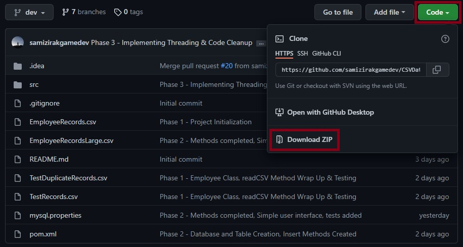
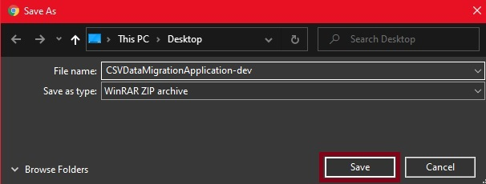
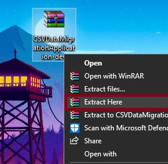
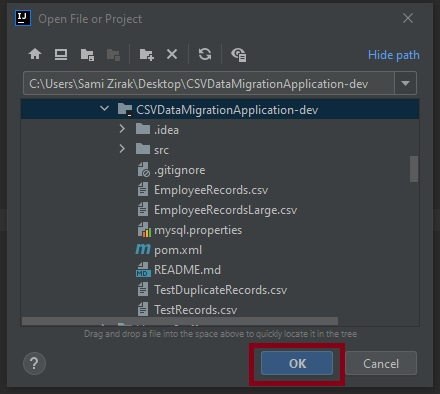

# CSV Data Migration Application (Java)
> Developed By:
> 
> • Sami Zirak - Junior Java SDET Consultant | [Portfolio](https://samiz.dev/) | [GitHub](https://github.com/samizirakgamedev) | [LinkedIn](https://www.linkedin.com/in/sami-zirak-dezfouly/) | [Twitter](https://twitter.com/SamiZirakDev) |
> 
> • Suyash Srivastava - Junior Java SDET Consultant | [GitHub](https://github.com/SuyashsGit) | [LinkedIn](https://www.linkedin.com/in/suyash-srivastava-0a977a15a/) |
> 
> • Donovan Cupueran - Junior Java SDET Consultant | [GitHub](https://github.com/djucacupueran) | [LinkedIn](https://www.linkedin.com/in/donovan-juca-01b7aa222/) |
> 
> • Gideon Troy - Junior Java SDET Consultant | [GitHub](https://github.com/Gideon9876543) | [LinkedIn](https://www.linkedin.com/in/gideon-troy-424b10216/) |
> 
The CSV Data migration application will read data from a CSV file, parse it, populate objects and add to a collection (HashMap). The program will be able to efficiently write the data from the objects to a relational (MySQL) database using JDBC. This project is being created as part of our ongoing training as Junior Java SDET's @ [Sparta Global](https://www.spartaglobal.com/).
### Table Of Contents ###
+ [Software & Dependencies](#software-&-dependencies)
+ [How To Use](#how-to-use)
+ [Planned Project Phases](#planned-project-phases)
    - [Phase 1](#phase-1)
    - [Phase 2](#phase-2)
    - [Phase 3](#phase-3)
    - [Phase 4](#phase-4)
+ [JUnit Testing](#junit-testing)
### Software & Dependencies ###
* **IntelliJ Community Edition** [Version 2021.3.2](https://www.jetbrains.com/idea/download/#section=windows)
* **JDK** [Version 17.0.2](https://jdk.java.net/17/)
* **Apache Maven**
    * _**Note:** This dependency can be imported using IntelliJ._
    * _Go to **"File" > "New Project"** and then selecting **"Maven"** as the project structure._
* **JUnit Jupiter API** [Version 5.8.2](https://mvnrepository.com/artifact/org.junit.jupiter/junit-jupiter-api/5.8.2)
    * _**Note:** This dependency can be imported within Intellij using Apache Maven and IntelliJ's built-in dependency generator._
    * Alternatively you can open the Maven **"pom.xml"** file and paste in the following code within the **"dependencies"** section of the file:
```xml
    <dependency>
        <groupId>org.junit.jupiter</groupId>
        <artifactId>junit-jupiter</artifactId>
        <version>5.8.2</version>
    </dependency>
```
* **Log4J Core** [Version 2.17.1](https://mvnrepository.com/artifact/org.apache.logging.log4j/log4j-core/2.17.1)
    * _**Note:** This dependency can be imported within Intellij using Apache Maven and IntelliJ's built-in dependency generator._
    * Alternatively you can open the Maven **"pom.xml"** file and paste in the following code within the **"dependencies"** section of the file:
```xml
    <dependency>
        <groupId>org.apache.logging.log4j</groupId>
        <artifactId>log4j-core</artifactId>
        <version>2.17.1</version>
    </dependency> 
```
<br/>
<div align="right">
    <b><a href="#csv-data-migration-application-java">↥ back to top</a></b>
</div>
<br/>

### How To Use ###
1. Navigate to the top of this GitHub repo and click the green **Code** button. This will open a menu where you will want to click **Download Zip**.


2. Having clicked **Download ZIP** a **Save As** dialogue box will open. Choose where you want to store the compressed CSV Data Migration program and then click the **Save** button.


3. Using Windows Explorer navigate to the location you saved the compressed CSV Data Migration program in. Right-click on the program and select **Extract Here**.


4. Open IntelliJ Community Edition and click **File** and then **Open**. Navigate to the extracted CSV Data Migration program project folder and select it. Then click **Ok**.


5. Once the project has opened and all dependencies have been downloaded look to the top right-hand corner of IntelliJ and ensure that the class that has been set to run is **CSVDataMigrationMain**. You can now run the program by clicking the green play button.

<div align="right">
    <b><a href="#csv-data-migration-application-java">↥ back to top</a></b>
</div>
<br/>

### Planned Project Phases ###
#### Phase 1 ####
Phase 1 has the following objectives:
* Write code to read data from an Employee CSV file.
* Make sure that as a CSV file is read in, that each line is added to a new object of a suitable class (Employee) and then added to a collection (HashMap).
* Make sure that any corrupt or duplicated data is added to a separate collection for further analysis.
* Write tests to ensure data is being managed correctly.
* Provide a simple user interface to display the results of reading the file – how many unique, clean records there are, how many duplicates, how many records with missing fields, possibly display the questionable records.
#### Phase 2 ####
Phase 2 has the following objectives:
* Write SQL statements to create a table and to persist data to that table. If the table exists, it will need to be dropped first.
* Create a data process object (DAO pattern) to persist the data to the database.
* Persist employee records and write code to retrieve individual record from the database.
#### Phase 3 ####
Phase 3 has the following objectives:
* Record time taken to persist data to the database.
* Add multithreading to the application to write the data to the database.
* Compare the execution time of writing to the database with multiple threads to the single-threaded version.
* Experiment with different numbers of threads and compare the results – what is the optimum number of threads? 
* Record this information in the README.md.
* Run tests to ensure the integrity of the data - make sure data has not been corrupted by adding multithreading to the application (check whether race conditions, for example, have changed the operation of the program).
#### Phase 4 ####
Phase 4 has the following objectives:
* Modify code to make use of functional programming concepts – lambdas and streams.
* Keep the original code and then run tests to see if efficiency has improved by adding functional code.
* Consider whether our code has been improved as a result of the changes.
<br/>
<div align="right">
    <b><a href="#csv-data-migration-application-java">↥ back to top</a></b>
</div>
<br/>

### JUnit Testing ###

<br/>
<div align="right">
    <b><a href="#csv-data-migration-application-java">↥ back to top</a></b>
</div>
<br/>